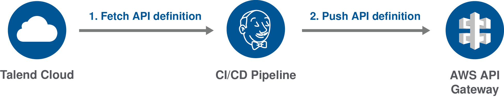
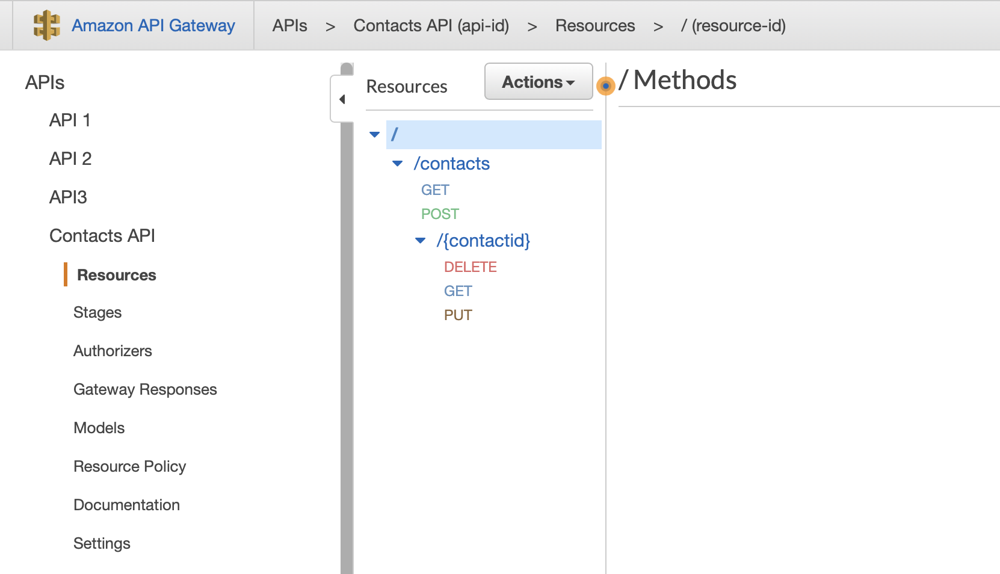
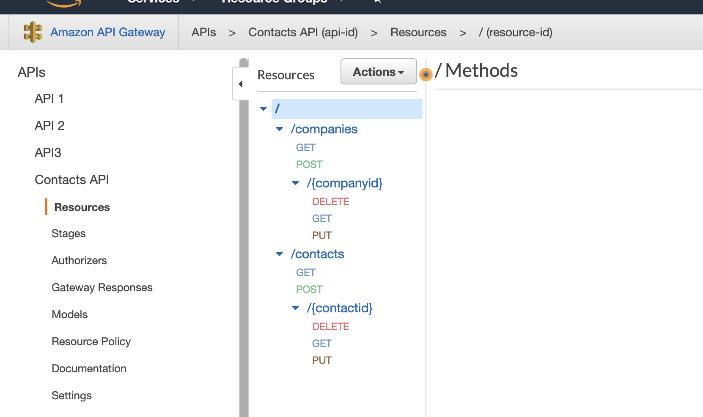

# Deploying an API definition to AWS API Gateway

This example explains how to import a new API definition or update an existing one in AWS API Gateway from Talend Cloud API Designer.



To do this, you first have to fetch your API from Talend Cloud, then you need to deploy it to AWS API Gateway using a command line script or a CI/CD pipeline.

The following procedures use AWS CLI, but you can also use the AWS API Gateway REST API.

For more information, see the following resources:

* [Talend Cloud API Designer User Guide](https://help.talend.com/access/sources/content/map?pageid=tapid_ug&EnrichVersion=Cloud&afs:lang=en)
* [AWS Command Line Interface User Guide](https://docs.aws.amazon.com/cli/latest/userguide/index.html)
* [AWS API Gateway Developer Guide](https://docs.aws.amazon.com/en_en/apigateway/latest/developerguide/index.html)
* [AWS API Gateway REST API Reference](https://docs.aws.amazon.com/apigateway/api-reference/)

## Fetching an API definition for AWS API Gateway

Export an API defintion as a JSON file compatible with AWS API Gateway from Talend Cloud API Designer.

Make sure that:
* You have installed cURL. For more information, see the [cURL documentation](https://curl.haxx.se/docs/).
* You have generated a Personal Access Token from Talend Cloud. For more information, see the [Talend Cloud API Designer User Guide](https://help.talend.com/access/sources/content/map?pageid=tapid_ug&EnrichVersion=Cloud&afs:lang=en).
* You have created an API in Talend Cloud API Designer.

1. Open a command line and enter the following command to export your API definition:
    ```
    curl --header "Authorization:Bearer {userToken}" -X GET -o {outFile}.json https://apid.{region}.cloud.talend.com/api/v1/api-definitions/{api-id}?format=OpenApi3Aws
    ```
2. Add the correct parameters:
    |Parameter|	Description|
    |---------|------------|
    |{userToken}|	Token generated from Talend Cloud.|
    |{outFile}|	Path and filename of your API definition. For example: contactsapi.json|
    |{region}|	Region for your Talend Cloud account. The value can be: us, eu, ap, at. For more information, see [Talend Cloud regions and URLs](https://help.talend.com/access/sources/content/map?pageid=talend_cloud_regions&EnrichVersion=Cloud&afs:lang=en).|
    |{api-id}|	ID of the API to fetch. To get it, open your API in Talend Cloud API Designer and go to **Settings** > **MANAGEMENT API**.|
3. Execute the command.

Your API definition is exported as a JSON file compatible with AWS API Gateway and saved in the selected directory.

For more information about exporting an API definition with an API gateway compatibility mode, see the [Talend Cloud API Designer User Guide](https://help.talend.com/access/sources/content/map?pageid=tapid_ug&EnrichVersion=Cloud&afs:lang=en).

## Importing an API definition to AWS API Gateway

Import your API definition as a JSON file to AWS API Gateway.

Make sure that:
* You have access to AWS API Gateway.
* You have installed AWS CLI. For more information, see [Installing the AWS CLI](https://docs.aws.amazon.com/cli/latest/userguide/cli-chap-install.html).
* You have exported your API definition as a JSON file.

1. Open a command line and enter the following command to upload the file:
    ```
    aws apigateway import-rest-api [--parameters endpointConfigurationTypes={type}] --body 'file://{yourfile}.json'
    ```
2. Add the correct parameters:
    |Parameter|	Description|
    |---------|------------|
    |{type}|	Optional. Defines the type of endpoint to use. The value can be: <br/><ul><li>*EDGE* for an edge-optimized API setup, most suitable for mobile applications (this is the default value).</li><li>*REGIONAL* for a regional API endpoint. </li><li>*PRIVATE* for a private API.</li></ul>|
    |{yourfile}|	Path and file name of the API definition you exported.|
3. Execute the command.

Your API is imported and the command line returns information about your API, such as its ID, which can be used to update it. You can check your API definition on the AWS API Gateway console.



For more information about the `import-rest-api` command, see the [AWS documentation](https://docs.aws.amazon.com/cli/latest/reference/apigateway/import-rest-api.html).

## Updating an API definition on AWS API Gateway

Import a JSON file to AWS API Gateway to update an existing definition.

Make sure that:
* You have access to AWS API Gateway.
* You have installed AWS CLI. For more information, see [Installing the AWS CLI](https://docs.aws.amazon.com/cli/latest/userguide/cli-chap-install.html).
* You have exported your API definition as a JSON file.
* You have uploaded a previous version of the API definition to AWS API Gateway.

1. Open a command line and enter the following command to upload the file:
    ```
    aws apigateway put-rest-api --rest-api-id {api-id} --mode {mode} --body 'file://{yourfile}.json'
    ```
2. Add the correct parameters:
    |Parameter|	Description|
    |---------|------------|
    |{api-id}|	AWS API Gateway ID of the API to update.|
    |{mode}|	Behavior at import. The value can be either *overwrite* to replace the previous version of the API with the new one, or *merge* to merge the two versions.|
    |{yourfile}|	Path and file name of the API definition you exported.|
3. Execute the command.

Your API definition is merged or overwritten, depending on the mode you defined. You can check your update on the AWS API Gateway console.

In this example, a first version of the API definition containing only the **/contacts** resource and its operations was uploaded. Then, a second version with the **/companies** resource was uploaded and merged with the previous version.



For more information about the `put-rest-api` command, see the [AWS documentation](https://docs.aws.amazon.com/cli/latest/reference/apigateway/put-rest-api.html).