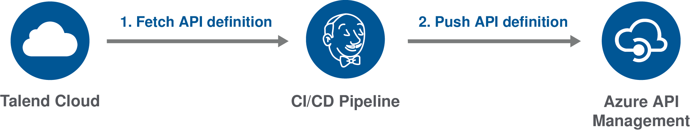
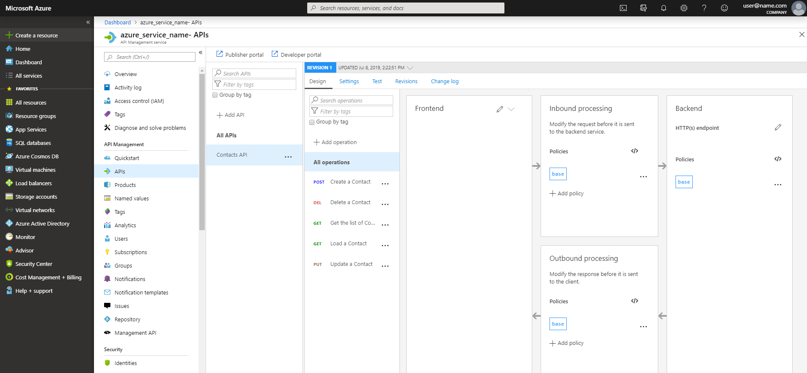
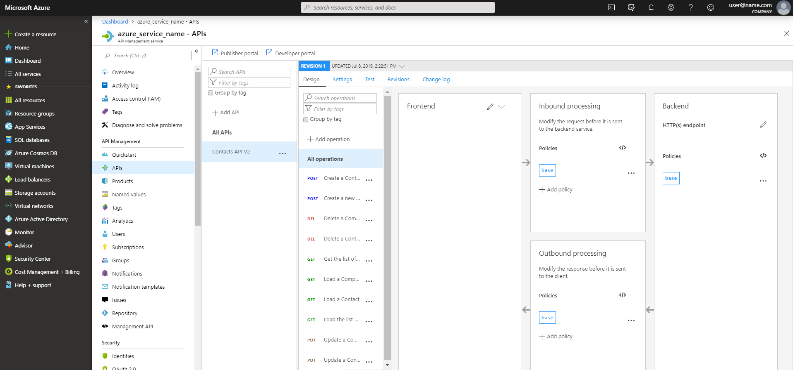

# Deploying an API definition to Azure API Management

This example explains how to import a new API definition or update an existing one in Azure API Management from Talend Cloud API Designer.



To do this, you first have to fetch your API from Talend Cloud, then you need to deploy it to Azure API Management using a command line script or a CI/CD pipeline.

The following procedures use Microsoft PowerShell, but you can also use the Azure API Management REST API.

For more information, see the following resources:

* [Talend Cloud API Designer User Guide](https://help.talend.com/access/sources/content/map?pageid=tapid_ug&EnrichVersion=Cloud&afs:lang=en)
* [Azure API Management documentation](https://docs.microsoft.com/en-us/azure/api-management/)
* [Microsoft PowerShell documentation](https://docs.microsoft.com/en-us/powershell/scripting/overview?view=powershell-6)
* [Azure PowerShell API Management documentation](https://docs.microsoft.com/en-us/powershell/module/az.apimanagement/?view=azps-2.4.0#api_management)
* [Azure API Management REST API Reference](https://docs.microsoft.com/en-us/rest/api/apimanagement/)

## Fetching an API definition for Azure API Management

Export an API defintion as a JSON file compatible with Azure API Management from Talend Cloud API Designer.

Make sure that:
* You have installed cURL. For more information, see the [cURL documentation](https://curl.haxx.se/docs/).
* You have generated a Personal Access Token from Talend Cloud. For more information, see the [Talend Cloud API Designer User Guide](https://help.talend.com/access/sources/content/map?pageid=tapid_ug&EnrichVersion=Cloud&afs:lang=en).
* You have created an API in Talend Cloud API Designer.

1. Open a command line and enter the following command to export your API definition:
    ```
    curl --header "Authorization:Bearer {userToken}" -X GET -o {outFile}.json https://apid.{region}.cloud.talend.com/api/v1/api-definitions/{api-id}?format=Swagger20Azure
    ```
2. Add the correct parameters:
    |Parameter|	Description|
    |---------|------------|
    |{userToken}|	Token generated from Talend Cloud.|
    |{outFile}|	Path and filename of your API definition. For example: contactsapi.json|
    |{region}|	Region for your Talend Cloud account. The value can be: us, eu, ap, at. For more information, see [Talend Cloud regions and URLs](https://help.talend.com/access/sources/content/map?pageid=talend_cloud_regions&EnrichVersion=Cloud&afs:lang=en).|
    |{api-id}|	ID of the API to fetch. To get it, open your API in Talend Cloud API Designer and go to **Settings** > **MANAGEMENT API**.|
3. Execute the command.

Your API definition is exported as a JSON file compatible with Azure API Management and saved in the selected directory.

For more information about exporting an API definition with an API gateway compatibility mode, see the [Talend Cloud API Designer User Guide](https://help.talend.com/access/sources/content/map?pageid=tapid_ug&EnrichVersion=Cloud&afs:lang=en).

## Importing an API definition to Azure API Management

Import your API definition to Azure API Management.

Make sure that:
* You have access to Azure API Manangement.
* You have installed Microsoft PowerShell. For more information, see the [Microsoft PowerShell documentation](https://docs.microsoft.com/en-us/powershell/scripting/install/installing-powershell?view=powershell-6).
* You have installed the Azure PowerShell module. For more information, see the [Microsoft Azure documentation](https://docs.microsoft.com/en-us/powershell/azure/install-az-ps?view=azps-2.4.0).
* You have exported your API definition.

1. Open your command line.
2. To avoid setting the context in each command, you can add it as a variable by executing the following command:
    ```
    $ApiMgmtContext = New-AzApiManagementContext -ResourceGroupName "{ResourceGroupName}" -ServiceName "{ServiceName}"
    ```
    |Parameter|	Description|
    |---------|------------|
    |{ResourceGroupName}|	Group of resources associated to the service. It can be found on the Microsoft Azure portal.|
    |{ServiceName}|	Name of the service. It can be found on the Microsoft Azure portal.|
3. Enter the following command to upload the file:
    ```
    Import-AzApiManagementApi -Context $ApiMgmtContext -SpecificationFormat "{format}" -SpecificationPath "{yourfile}" -Path "{api-url-suffix}" 
    ```
4. Add the correct parameters:
    |Parameter|	Description|
    |---------|------------|
    |{format}|	Format of the API definition to import. The value can be: `Swagger` (recommended), `Wadl`, `Wsdl`, `OpenApi`|
    |{yourfile}|	Path and file name of the API definition you exported.|
    |{api-url-suffix}|	Web API path to add at the end of your API's public URL.|

Your API is imported and the command line returns information about your API, such as its ID, which can be used to update it. You can check your API definition on the Azure portal.



For more information about the `Import-AzApiManagementApi` command, see the [Azure documentation](https://docs.microsoft.com/en-us/powershell/module/az.apimanagement/Import-AzApiManagementApi?view=azps-2.4.0).

## Updating an API definition in Azure API Management

Import a file to Azure API Management to update an existing definition.

Make sure that:
* You have access to Azure API Manangement.
* You have installed Microsoft PowerShell. For more information, see the [Microsoft PowerShell documentation](https://docs.microsoft.com/en-us/powershell/scripting/install/installing-powershell?view=powershell-6).
* You have installed the Azure PowerShell module. For more information, see the [Microsoft Azure documentation](https://docs.microsoft.com/en-us/powershell/azure/install-az-ps?view=azps-2.4.0).
* You have exported your API definition.
* You have uploaded a previous version of the API definition to Azure API Management.
* You have set your context parameters as a variable. For more information, see the procedure above.

1. Open a command line and enter the following command to upload the file:
    ```
    Import-AzApiManagementApi -Context $ApiMgmtContext -SpecificationFormat "{format}" -SpecificationPath "{yourfile}" -ApiId "{api-id}" -Path "{api-url-suffix}"
    ```
2. Add the correct parameters:
     |Parameter|	Description|
    |---------|------------|
    |{format}|	Format of the API definition to import. The value can be: `Swagger` (recommended), `Wadl`, `Wsdl`, `OpenApi`|
    |{yourfile}|	Path and file name of the API definition you exported.|
    |{api-id}|	Azure API Management ID of the API to update.|
    |{api-url-suffix}|	Web API path to add at the end of your API's public URL.|
3. Execute the command.

Your API definition is imported and the new file replaces the previous version. You can check your update on the Azure portal.

In this example, a first version of the API definition named **Contacts API**, which contained five operations was uploaded. Then, it was replaced with a new definition named **Contacts API V2** containing ten operations.



For more information about the `Import-AzApiManagementApi` command, see the [Azure documentation](https://docs.microsoft.com/en-us/powershell/module/az.apimanagement/Import-AzApiManagementApi?view=azps-2.4.0).

